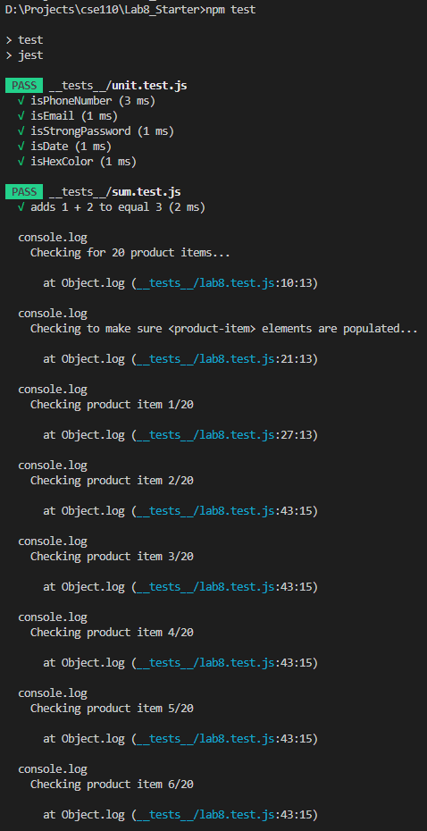
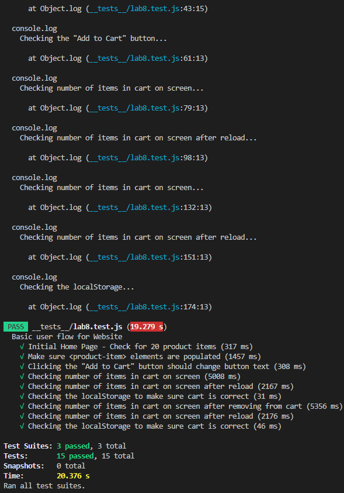

# Lab 8 - Starter
Name: Jeffrey Liu

1) Manually run them locally before pushing code because it is important that all code is working and passes tests before other people pull the code and start working on them. Using a GitHub action for this could work, but it could be redundant since you have to push code everytime you want to do testing. Test-driven development is key, so it wouldn't make much sense as well to only start the testing after developing and pushing to GitHub.

2) No, that is a job more for unit tests. E2E tests are more for testing workflows and entire processes and journeys. 

3) No, because writing and sending a message has too many components to it that would require more extensive testing that E2E test would offer rather than a simple unit test. 

4) Yes, because this feature is very testable. It is a very binary result whether or not the max length that is allowed is actually 80 characters or not. 

